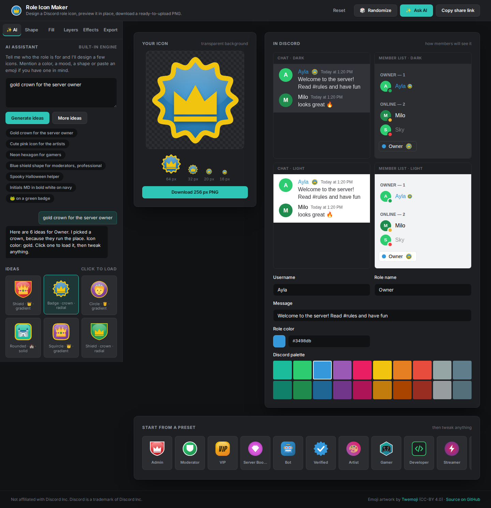

# Role Icon Maker for Discord

Design your own Discord **role icon** in the browser: pick a shape, colors, an emoji, text, a symbol or your own image, add a border, shadow or gloss, preview it exactly where Discord shows it, and download a PNG that is ready to upload. Not sure what to make? Describe the role to the built-in **AI assistant** and pick from the icons it designs.



## Features

- **AI assistant**: type something like "a gold crown for the server owner", "cute pink icon for the artists" or "neon hexagon for gamers" and get six complete designs, with an explanation of the choices. Then steer it with "make it darker", "add a border", "use a skull", "hexagon" or "make it red". Out of the box it uses a built-in language engine that runs in your browser (no API keys, nothing leaves the page). Add an API key and it switches to **smart mode**, where a Claude model understands anything you type. See [Smart mode](#smart-mode-optional).
- **Shapes**: circle, rounded square, square, squircle, hexagon, shield, diamond, star, heart, badge, a polygon with any number of sides from 3 to 12, a starburst with 3 to 24 points and adjustable spike depth, or no background at all. Every shape rotates freely.
- **Fills**: solid color, linear gradient with angle, radial gradient, plus Discord's default role color palette as one-click swatches.
- **Unlimited layers**: stack up to 24 marks on one icon and combine anything with anything. Text next to an emoji, a symbol over a shape, two images, a pale plate behind a crown. Each layer has its own size, position, rotation, opacity, flip, drop shadow, blend mode and a switch for whether it is clipped to the background silhouette. Reorder, hide, duplicate and delete from the Layers tab.
- **Content per layer**: 280+ curated emoji (paste any other emoji), text or initials with outline and letter spacing in nine ready-made fonts or any Google Font by name, 18 built-in symbols, a shape used as a decorative plate or ring, or an uploaded image (PNG, JPG, GIF, WebP, SVG) that stays in your browser.
- **Effects**: border, drop shadow, glossy highlight, content shadow, and full placement control (size, offset, rotation, opacity).
- **Live Discord preview**: a chat message and a member list in dark and light themes, with your own username, role name and role color.
- **Export**: PNG at 64, 128, 256 or 512 px with a live file-size estimate and a warning when it would exceed Discord's 256 KB limit. Copy to clipboard or download.
- **Presets, randomize, share links**: start from 12 presets, roll a random design, and share a design as a URL. Your work is saved locally between visits.

## Use it in Discord

1. Download the PNG (256 px is a good default).
2. In Discord open **Server Settings → Roles**, pick the role, then **Display → Role Icon** and upload the file.
3. Requirements set by Discord: the server needs **Boost Level 2**, and the icon must be at least **64×64 px**, square, **PNG or JPG**, and under **256 KB**. Animated icons are not supported. Discord shows the icon at about 20 px next to member names, so bold, simple designs work best.

## Run it locally

```bash
npm install
npm run dev
```

Open the printed URL (usually http://localhost:5173). Other scripts:

```bash
npm run build      # type-check and build to dist/
npm run preview    # serve the production build
npm test           # unit tests (Vitest)
npm run typecheck  # tsc only
npm run smoke      # headless browser smoke test, see below
```

The smoke test drives the built app in headless Chromium: it checks rendering, a control change, a real PNG download, the share link, presets, persistence and the mobile layout, and refreshes `docs/screenshot.png`. It needs a Playwright install that is not part of this project:

```bash
npm run build
npx playwright install chromium          # once
PLAYWRIGHT_MODULE_DIR=$(npm root -g) npm run smoke
```

`PLAYWRIGHT_MODULE_DIR` points at a directory that contains the `playwright` package (a global `npm install -g playwright` works).

## Smart mode (optional)

Smart mode sends the description to a Claude model, which understands free-form language ("something that says 'we take pizza seriously' but keep it classy") and returns designs in the app's own format. It runs as a small server function (`api/assistant.ts`) so the key never reaches the browser; without a key the built-in engine is used and nothing else changes.

1. Create an API key at [console.anthropic.com](https://console.anthropic.com/).
2. In Vercel open the project, then **Settings → Environment Variables**, add `ANTHROPIC_API_KEY` with the key, and redeploy.
3. Optionally add `ASSISTANT_MODEL` to pick a different model (default `claude-opus-5`; `claude-sonnet-5` or `claude-haiku-4-5` are cheaper).

For local development copy `.env.example` to `.env.local` and fill in the key; `npm run dev` serves `/api/assistant` through the same code as Vercel.

What to expect: each request costs a few cents with the default model (roughly 2,000 input and 1,500 output tokens), responses take a few seconds, and the function rate-limits each visitor to 20 requests per 10 minutes. If the model is unavailable, rate-limited or declines a request, the built-in engine answers instead and the reply says so. The assistant tab shows which engine is active.

## Deploy to Vercel

Import the repository in Vercel. `vercel.json` already declares the Vite framework, the build command and the `dist` output, so no settings are needed. Every push to the production branch deploys automatically. Alternatively run `npx vercel` from a checkout.

The app is fully static; any static host works with the contents of `dist/`.

## How it works

- The built-in assistant (`src/assistant/`) is a rule-based engine: it tokenizes the description, pulls out colors (including "dark blue" or `#ff0000`), shapes, quoted text or initials, pasted emoji, negations ("no border", "don't use emoji"), style adjectives (cute, neon, minimal, professional, spooky…), and matches the rest against a lexicon of 40+ role themes (admin, moderator, gamer, artist, streamer…), a curated noun list and the full Unicode emoji keyword list (`src/emoji/keywords.ts`, about 3,900 words generated from CLDR by `scripts/build-emoji-keywords.mjs`). Word forms are matched loosely, so "coding" finds "code" and "gamers" finds "game". From those ingredients it composes several distinct icon states with a seeded random generator, so the same prompt always gives the same ideas and "More ideas" reseeds. Follow-up instructions are parsed the same way and applied as deltas to the current icon.
- Smart mode (`src/server/assistant.ts`) asks a Claude model for the same data through a strict JSON schema (structured outputs), then validates every field with the same sanitizer the share links use, so a model answer can never produce an invalid icon.
- A single canvas renderer (`src/render/renderIcon.ts`) draws the icon at any pixel size from normalized coordinates, so the big preview, the tiny Discord mock previews, the preset thumbnails and the exported PNG are pixel-identical.
- Emoji artwork comes from [Twemoji](https://github.com/jdecked/twemoji), loaded from jsDelivr and re-served as same-origin blobs so the canvas never gets tainted. If the CDN is unreachable the system emoji font is used and the export tab says so.
- Fonts come from Google Fonts. Uploaded images are downscaled to at most 1024 px and kept as data URLs in `localStorage`.
- Share links encode the design in the URL hash (uploaded images are left out).

Stack: Vite, React, TypeScript, no UI framework, Vitest for the pure logic, the Anthropic SDK and Zod for smart mode.

## Credits and disclaimer

Emoji artwork by [Twemoji](https://github.com/jdecked/twemoji), licensed CC-BY 4.0. Fonts served by Google Fonts. Not affiliated with Discord Inc.; Discord is a trademark of Discord Inc. The Discord-style previews are original CSS mock-ups.
